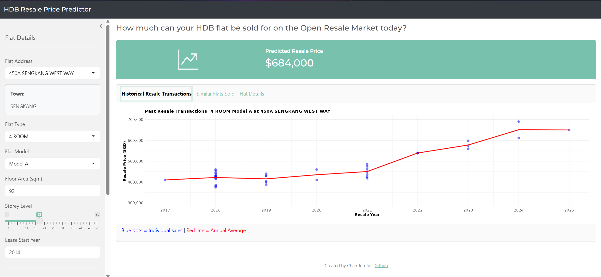

# HDB Resale Price Prediction

-blue)


An end-to-end predictive analytics project investigating 200,000+ HDB resale transactions (2017-2025). The workflow includes data cleaning, geocoding via OneMap API, geospatial feature engineering, and exploratory data analysis, culminating in a production-grade valuation model.

The final **XGBoost** model achieves an **$R^2$ of 0.976** and an **RMSE of $28.7k**, reducing prediction error by **~46%** compared to the baseline OLS linear regression model.

### **[Try the Shiny App](https://chan-jun-jie.shinyapps.io/hdb-resale-price-prediction/)**

<figure>
  
  <br>
  <figcaption style="text-align: center;">
    <i>Shiny App Dashboard</i>
  </figcaption>
</figure>

## Problem Statement
Estimating the resale value of an HDB flat in Singapore is difficult due to non-linear relationships between resale price and factors like storey level, distances from MRT / CBD, as well as interaction effects between factors. 

This project aims to provide potential buyers and sellers of HDB flats with an instant, data-driven prediction for the resale price of their flat using machine learning models, improving price transparency and decision-making in the resale market.


## Dataset
### 1. Primary Data Source
The primary dataset consists of 200,000+ HDB resale flat transactions (Jan 2017 - Dec 2025) obtained from **[Data.gov.sg](https://data.gov.sg/)**. Each row represents a single resale transaction and includes attributes such as resale price, flat type and floor area.

The raw dataset was saved as `raw_resale_prices.csv` and cleaned using `01_data_cleaning.R` to address missing values, inconsistent formatting, and data type issues, producing `cleaned_resale_prices.csv`.

### 2. External Data
All unique HDB addresses (~9,000) were geocoded using the **[OneMap API](https://www.onemap.gov.sg/docs/)**, to obtain the latitude and longitude coordinates stored in `hdb_coordinates.csv`.

MRT and LRT station location data (`mrt_lrt_stations.csv`) was sourced from [Kaggle - MRT & LRT Stations in Singapore](https://www.kaggle.com/datasets/lzytim/full-list-of-mrt-and-lrt-stations-in-singapore) and was used to obtain coordinates for all rail stations in Singapore.

### Feature Engineering
Using `03_feature_engineering.R`, the cleaned transaction data was enriched with geospatial features, including:
- Latitude and longitude of the resale flat
- Distance to the nearest MRT/LRT station
- Distance to the Central Business District (CBD)

This produced the enriched dataset `enriched_resale_prices.csv`.

### Final Modelling Dataset
Further data filtering, outlier handling and transformations were performed during exploratory data analysis in `04_eda.R`. The final dataset, `modelling_resale_prices.csv`, was used to train the machine learning models.


## Project Methodology
### Data Splitting & Validation

The dataset was split into training (80%) and test (20%) sets using stratified sampling on resale price, ensuring that both sets have the same distribution of resale price.

All models were trained using 10-fold cross-validation (caret). The same package (caret) is used for 10-fold cross-validation, feature selection and hyperparameter tuning.

### Target Transformation

Resale prices were log-transformed prior to modelling to address right skew to better satisfy the linear model assumption of homoskedasticity.
Model predictions were transformed back to the original SGD scale for easier evaluation and interpretation of results.


## Models Implemented
### Baseline Models
Ordinary Least Squares (OLS) linear regression on all reasonable features was used as a baseline model to establish a simple, interpretable benchmark. 

Stepwise regression using the Akaike Information Criterion (AIC) was also applied to assess whether automated feature selection would improve model parsimony and predictive performance.

### Regularised Linear Models
To address multicollinearity and improve model stability, regularised regression models, including Ridge, Lasso, and Elastic Net, were trained. 

### Non-Linear Tree-Based Models
Random Forests and XGBoost models were trained to try capturing non-linear relationships and interaction effects between features. 

## Model Evaluation & Comparison

Model performance was evaluated using a held-out test set to assess out-of-sample predictive accuracy. All models were trained using the same stratified data splits and cross-validation strategy to ensure a fair and consistent comparison.

Within the training set, **10-fold cross-validation** was used for model training, feature selection, and hyperparameter tuning. This ensured that performance estimates reflected generalisation ability rather than fitting to a single subset of the data.

Models were compared using the following metrics:
- **RMSE (Root Mean Squared Error)** to penalise large prediction errors
- **MAE (Mean Absolute Error)** for robustness to outliers
- **R² (Coefficient of Determination)** to measure explained variance

| | Model | RMSE (SGD) | MAE (SGD) | $R^2$ |
| :--- | :--- | :--- | :--- | :--- |
| 1 | XGBoost | 28705.97 | 20958.76 | 0.9764 |
| 2 | Random Forest | 29857.11 | 21003.86 | 0.9747 |
| 3 | Stepwise AIC | 53494.38 | 40258.31 | 0.9183 |
| 4 | OLS Baseline | 53494.66 | 40258.65 | 0.9183 |
| 5 | Elastic Net | 53599.06 | 40311.82 | 0.9181 |
| 6 | Lasso | 53612.46 | 40308.71 | 0.9180 |
| 7 | Ridge | 57164.41 | 42552.32 | 0.9111 |

## Project Structure

```text
├── data/
│   ├── raw/
│   │   └── raw_resale_prices.csv
│   ├── external/
│   │   ├── hdb_coordinates.csv
│   │   └── mrt_lrt_stations.csv
│   └── processed/
│       ├── cleaned_resale_prices.csv
│       ├── enriched_resale_prices.csv
│       └── modelling_resale_prices.csv
│
├── scripts/
│   ├── 01_data_cleaning.R
│   ├── 02_geocoding.R
│   ├── 03_feature_engineering.R
│   ├── 04_eda.R
│   ├── 05_model_linear.R
│   ├── 06_model_regularised.R
│   ├── 07_model_advanced.R
│   └── 08_compare_models.R
│
├── output/
│   ├── figures/
│   └── models/
│
├── app/
│   └── app.R
│
└── README.md
```

## Tech Stack

- **Programming Language:** R  
- **Data Wrangling:** tidyverse  
- **Data Visualisation:** ggplot2  
- **Geospatial Analysis:** geosphere  
- **Machine Learning:** caret, ranger, xgboost  
- **Deployment:** R Shiny (bslib), shinyapps.io  

## Live Web App

An interactive **R Shiny** web app is available for users to input details of any HDB flat eligible for resale on the Opne Resale Market, and see the prediction for the resale price if the flat were sold in Dec 2025.

The app also shows a plot and table of past resale transactions of resale flats of the same type, model and address for users to compare the prediction with past sales.

👉 **Live App:** https://chan-jun-jie.shinyapps.io/hdb-resale-price-prediction/


## How to Run the Project

1. Run `01_data_cleaning.R` to clean the raw resale transaction data  
2. Run `02_geocoding.R` to generate latitude and longitude coordinates for each HDB addresses
3. Run `03_feature_engineering.R` to engineer geospatial features  
4. Run `04_eda.R` to perform exploratory analysis and generate the final modelling dataset
5. Train models using `05_model_linear.R`, `06_model_regularised.R`, and `07_model_advanced.R`  
6. Compare model performance using `08_compare_models.R`  