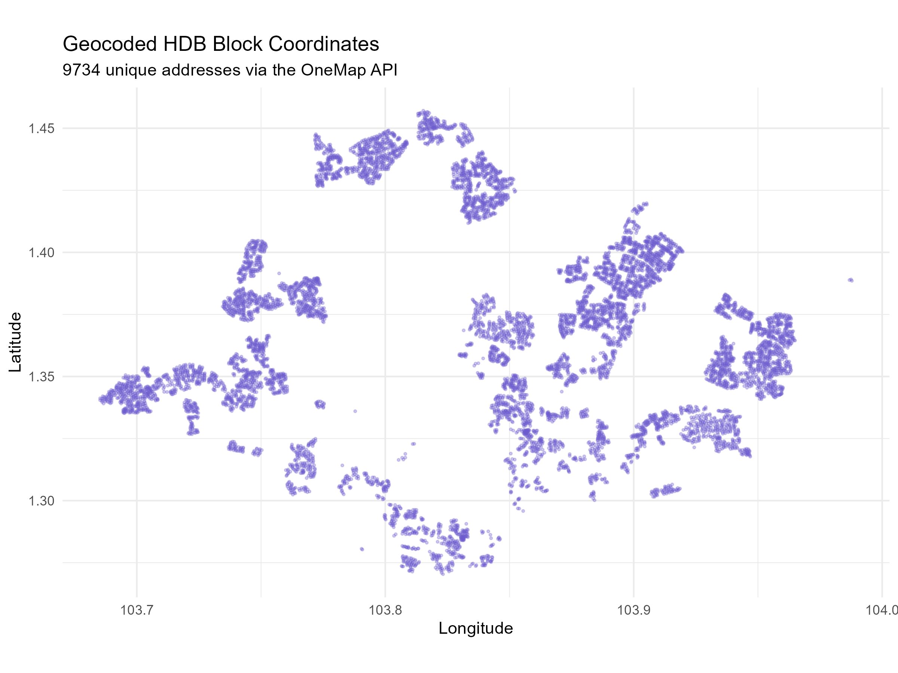
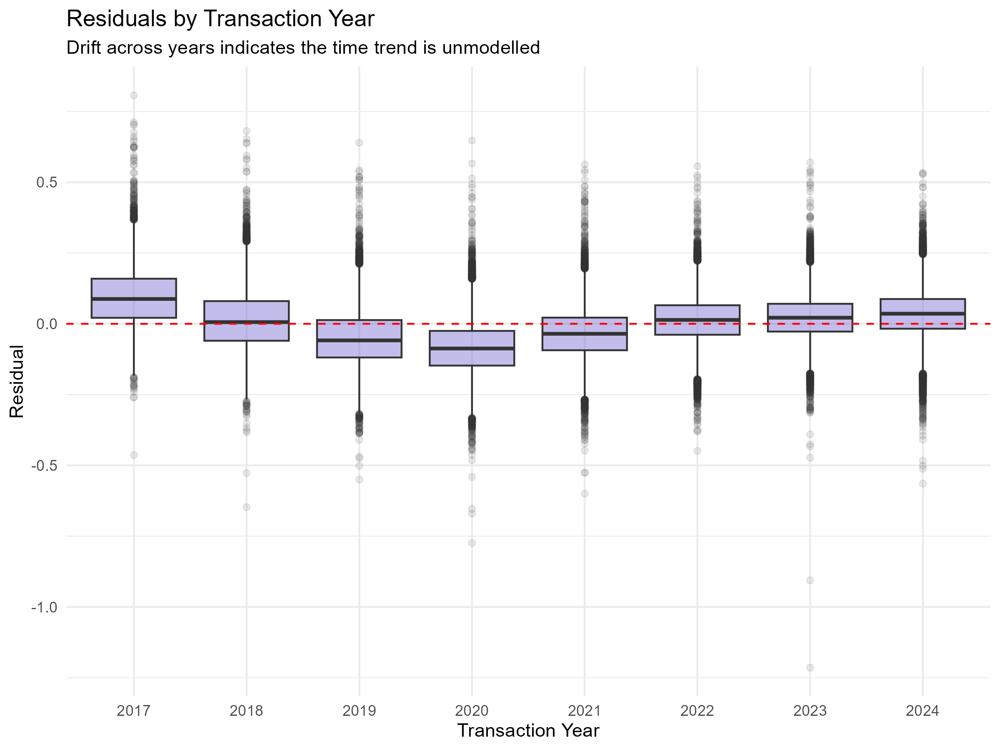
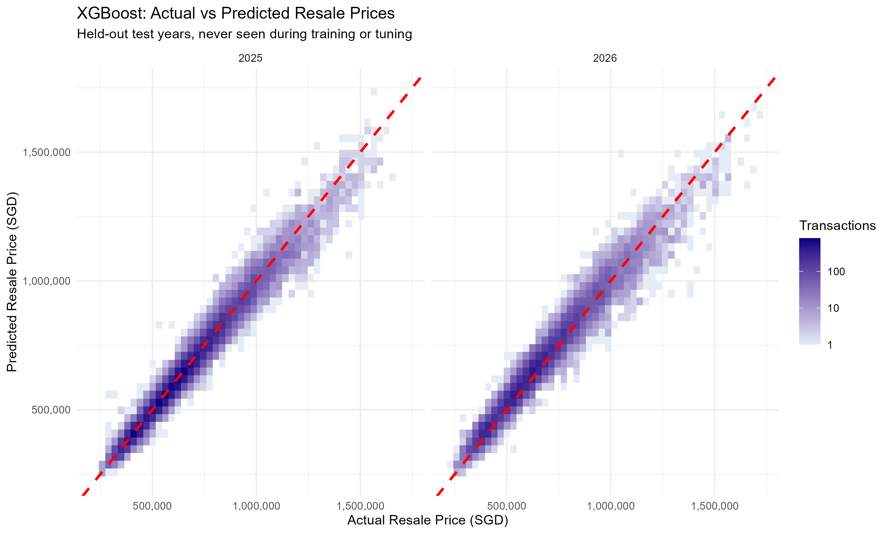

# HDB Resale Price Prediction

-blue)


An end-to-end machine learning project that predicts the resale price of Singapore HDB flats from 237,000+ transactions (Jan 2017 – Aug 2026). The pipeline covers data cleaning, geocoding every block through the OneMap API, point-in-time geospatial feature engineering, exploratory analysis, and a time-aware comparison of seven models, served through an interactive Shiny app.

Evaluated on **2025–2026 sales it never saw during training or tuning**, the final **XGBoost** model achieves an **$R^2$ of 0.962** and a **mean absolute percentage error of 4.5%**, with half of all predictions within **3.5%** of the actual price.

### **[Try the Shiny App](https://chan-jun-jie.shinyapps.io/hdb-resale-price-prediction/)**

<figure>
  
  <br>
  <figcaption style="text-align: center;">
    <i>Shiny App Dashboard</i>
  </figcaption>
</figure>

## Problem Statement
Estimating the resale value of an HDB flat in Singapore is difficult due to non-linear relationships between resale price and factors like storey level, remaining lease, and distance from MRT stations and the CBD, as well as interaction effects between them.

This project gives potential buyers and sellers of HDB flats an instant, data-driven estimate of a flat's resale price, together with a likely price range and the block's past transactions, improving price transparency and decision-making in the resale market.


## Dataset
### Resale Transactions
HDB's *Resale flat prices based on registration date from Jan-2017 onwards* ([data.gov.sg](https://data.gov.sg/datasets?query=hdb+resale&resultId=d_8b84c4ee58e3cfc0ece0d773c8ca6abc), dataset `d_8b84c4ee58e3cfc0ece0d773c8ca6abc`), retrieved 17 Aug 2026: **238,064 transactions** from Jan 2017 to Aug 2026. The raw snapshot is committed so every result in this README is reproducible.

Two exclusion rules, applied and logged in `04_build_modelling_data.R`, produce the modelling dataset of **237,735 transactions**:

| Rule | Rows dropped |
| :--- | ---: |
| Exact duplicate rows | 317 |
| Floor area ≥ 200 sqm (terrace houses and outsized maisonettes) | 12 |

### Geocoding
All **9,734 unique HDB addresses** were geocoded with the **[OneMap Search API](https://www.onemap.gov.sg/docs/)**. The geocoding script caches results, retries failed requests with exponential backoff, and rejects any coordinate outside Singapore's bounding box. A separate validation step (`02b_validate_geocoding.R`) halts the pipeline if any address is missing, duplicated or out of bounds.

<p align="center">
  
</p>

### MRT and LRT Stations
Coordinates for all **216 MRT and LRT stations**, current to the opening of Circle Line Stage 6 in July 2026. Coordinates come from OneMap, and each station carries its opening date.


## Feature Engineering
Every model is trained on the same 12 predictors:

| Group | Features |
| :--- | :--- |
| Flat | `flat_type`, `flat_model`, `floor_area_sqm`, `storey_mid` |
| Lease | `remaining_lease_numeric`, `lease_commence_date` |
| Location | `town`, `lat`, `long`, `distance_to_cbd`, `distance_to_nearest_mrt` |
| Time | `resale_year` |

- **Point-in-time rail access.** `distance_to_nearest_mrt` only counts stations that were open on the date of each sale, so a block's value changes when a new line opens nearby. Distances are computed once per address against every station, then resolved per transaction by opening date.
- **Coordinates as features.** Raw latitude and longitude let the tree models learn fine-grained, block-level location effects that a 26-level `town` factor cannot capture.
- **Build vintage.** `lease_commence_date` alongside remaining lease lets the model separate a flat's age from its build cohort.
- **Storey.** HDB reports storeys in 3-storey bands (e.g. "10 TO 12"); each band is modelled at its midpoint.
- **Remaining lease** is parsed from HDB's `"61 years 04 months"` text format into a decimal number of years.


## Methodology
### Time-Based Train/Test Split
Because the model's job is to price flats *going forward*, it is evaluated the same way. Transactions are split by year rather than at random:

- **Training:** 2017–2024 (196,674 transactions)
- **Test:** 2025–2026 (41,061 transactions), held out until a single final model is chosen

### Expanding-Window Cross-Validation
Hyperparameters are tuned and models are compared with five expanding-window folds, each validating on the year immediately after its training window:

| Fold | Train | Validate |
| :---: | :--- | :--- |
| 1 | 2017–2019 | 2020 |
| 2 | 2017–2020 | 2021 |
| 3 | 2017–2021 | 2022 |
| 4 | 2017–2022 | 2023 |
| 5 | 2017–2023 | 2024 |

The best model is selected on **cross-validated RMSE**, and only that model is scored on the test set.

### Target Transformation
Resale prices are right-skewed, so models are trained on log price. Predictions are transformed back to SGD with **Duan's smearing correction**, which removes the downward bias of a plain `exp()` back-transform.


## Models Implemented
| Family | Models |
| :--- | :--- |
| Reference | Median price per sqm by town and flat type, from the latest training year |
| Linear | OLS, Stepwise AIC |
| Regularised | Ridge, Lasso, Elastic Net |
| Tree ensembles | Random Forest (`ranger`), XGBoost |

Location, size and lease features are strongly collinear: `lat`, `long` and `distance_to_cbd` each have a variance inflation factor above 45, and `floor_area_sqm` above 20. The regularised models test whether shrinkage improves on OLS under that collinearity.


## Results
### Model Comparison (Cross-Validation)

| | Model | CV RMSE (log price) | CV MAE (log price) | CV $R^2$ |
| :--- | :--- | ---: | ---: | ---: |
| 1 | **XGBoost** | **0.0734** | **0.0572** | **0.962** |
| 2 | Random Forest | 0.0913 | 0.0745 | 0.960 |
| 3 | Stepwise AIC | 0.1269 | 0.1045 | 0.913 |
| 4 | OLS | 0.1269 | 0.1045 | 0.913 |
| 5 | Lasso | 0.1270 | 0.1049 | 0.912 |
| 6 | Elastic Net | 0.1271 | 0.1046 | 0.912 |
| 7 | Ridge | 0.1311 | 0.1088 | 0.908 |
| 8 | Median $/sqm | 0.1934 | 0.1424 | 0.710 |

An RMSE of 0.073 on the log scale corresponds to a typical error of roughly 7%. XGBoost cuts cross-validated error by **42% relative to OLS** and by **62% relative to the median price-per-sqm reference**.

### Why the Tree Models Win
HDB prices did not move in a straight line: they edged down from 2017 to 2019, then rose sharply from 2020. A linear model's single `resale_year` coefficient cannot follow that path, which shows up as a clear pattern in its residuals by year. The tree ensembles learn the shape of the price path directly, along with non-linear location and lease effects.

<p align="center">
  
</p>

### Final Test Performance (XGBoost, 2025–2026)

| Metric | Value |
| :--- | ---: |
| $R^2$ | 0.962 |
| RMSE | $40,301 |
| MAE | $29,117 |
| MAPE | 4.5% |
| Median absolute % error | 3.5% |

$R^2$ is computed as $1 - SSE/SST$ on the SGD scale.

Accuracy is consistent across flat types:

| Flat Type | Test Sales | MAE | MAPE |
| :--- | ---: | ---: | ---: |
| 2 Room | 1,331 | $17,212 | 4.6% |
| 3 Room | 9,879 | $22,662 | 5.0% |
| 4 Room | 17,873 | $28,792 | 4.3% |
| 5 Room | 9,519 | $34,551 | 4.3% |
| Executive | 2,439 | $42,931 | 4.5% |

<p align="center">
  
</p>


## Live Web App
The **R Shiny** app lets users price any HDB block that has had a resale since 2017:

- **Prediction:** enter an address, flat type, flat model, floor area, lease start year and storey. The form pre-fills with the most common values for that block, and inputs are validated against the range the model was trained on.
- **Prediction interval:** an 80% prediction interval around each estimate, derived from the model's out-of-sample cross-validation errors for that flat type.
- **Comparable sales:** a price trend chart and a table of past transactions of the same flat type and model at the same address.

Prices are estimated as at the latest month in the data.

👉 **Live App:** https://chan-jun-jie.shinyapps.io/hdb-resale-price-prediction/


## Project Structure

```text
├── run_all.R                       # Pipeline orchestrator
├── R/                              # Shared functions
│   ├── config.R                    #   Predictors and shared constants
│   ├── geocoding.R                 #   OneMap client and bounding-box checks
│   ├── prepare_model_data.R        #   Time-based split and CV folds
│   ├── evaluate.R                  #   Smearing, metrics, prediction intervals
│   ├── diagnostics.R               #   VIF and residual diagnostics
│   ├── baseline.R                  #   Median price-per-sqm reference model
│   ├── models.R
│   └── tuning.R
│
├── scripts/
│   ├── 00_download_data.R          # Optional: refresh from data.gov.sg
│   ├── 01_data_cleaning.R
│   ├── 02_geocoding.R
│   ├── 02b_validate_geocoding.R
│   ├── 03_feature_engineering.R
│   ├── 04_build_modelling_data.R
│   ├── 05_eda.R
│   ├── 06_model_linear.R
│   ├── 07_model_regularised.R
│   ├── 08_model_advanced.R
│   ├── 09_compare_models.R
│   └── 10_build_app_bundle.R
│
├── data/
│   ├── raw/                        # data.gov.sg snapshot (tracked)
│   ├── external/                   # Geocoded addresses, MRT/LRT stations (tracked)
│   └── processed/                  # Built by the pipeline
│
├── output/
│   ├── figures/
│   ├── metrics/                    # CV, test and per-segment results
│   ├── summaries/                  # Model summaries and VIF
│   └── models/                     # Trained models (built by the pipeline)
│
├── app/
│   ├── app.R
│   ├── R/global.R
│   ├── data/                       # App bundle (built by stage 10)
│   └── models/
│
└── renv.lock                       # Pinned package versions
```

## Tech Stack

- **Language:** R 4.5.2, with package versions pinned by **renv**
- **Data Wrangling:** tidyverse
- **Data Visualisation:** ggplot2
- **Geospatial:** OneMap API (httr, jsonlite), geosphere
- **Machine Learning:** caret, glmnet, ranger, xgboost
- **Deployment:** R Shiny (bslib), shinyapps.io


## How to Run the Project

1. Restore the pinned package environment:
   ```r
   renv::restore()
   ```
2. Run the full pipeline. Each stage runs in its own R session, is timed, and the run stops at the first failure:
   ```bash
   Rscript run_all.R              # every stage
   Rscript run_all.R --from 06    # from a given stage onward
   Rscript run_all.R 01 03 04     # specific stages only
   Rscript run_all.R --list       # list the stages
   ```
   Geocoded coordinates are committed, so stage 02 only queries OneMap for addresses not already cached. Model tuning (stage 08) takes over an hour on a laptop.
3. Launch the app locally:
   ```r
   shiny::runApp("app")
   ```

To refresh the data, `Rscript scripts/00_download_data.R` downloads the latest extract from data.gov.sg to a dated file alongside the committed snapshot.
